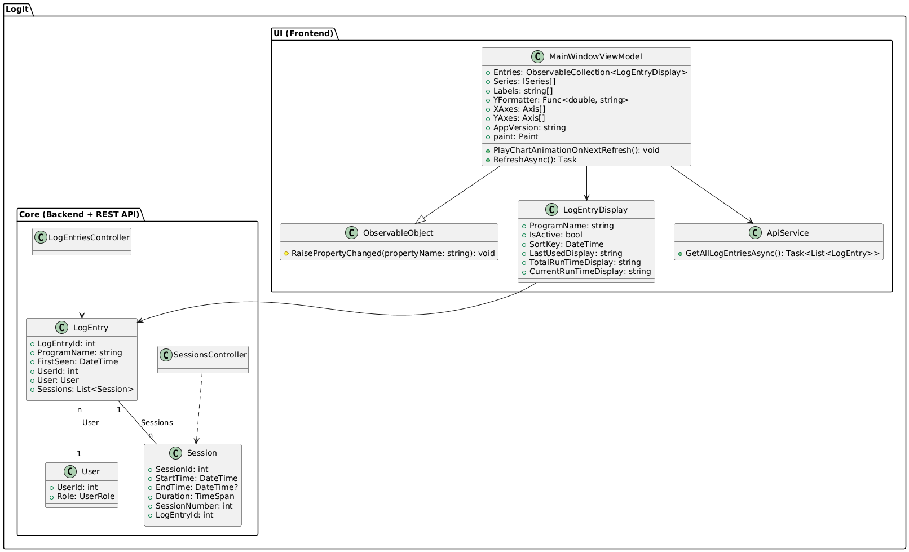
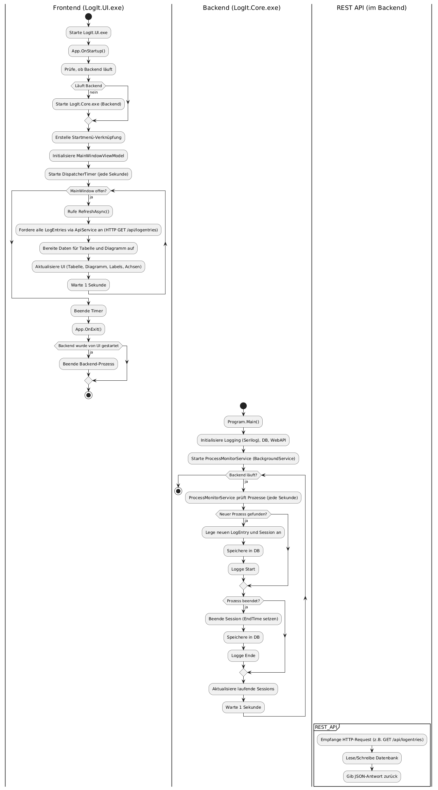
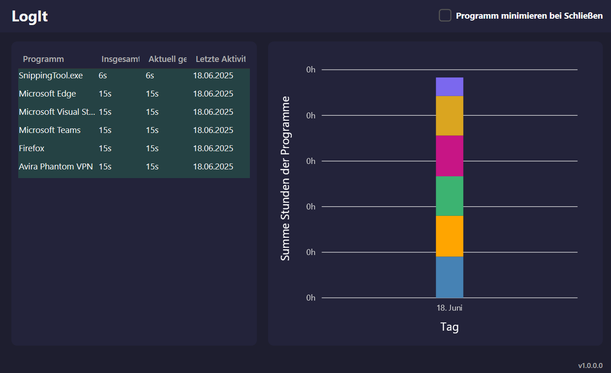

# Dokumentation - LogIt

> Programm-Analyse-Tool, das laufende Programme loggt und darstellt

---

## Inhaltsverzeichnis

- [UML-Diagramme](#uml-diagramme)
- [Lastenheft](#lastenheft)
- [Pflichtenheft](#pflichtenheft)
- [Projekttagebuch](#projekttagebuch)
- [Tests](#tests)
- [Bedienungsanleitung](#bedienungsanleitung)
- [Quellen](#quellen)

---

## UML-Diagramme

>Diagramme mit [PlantUML](https://plantuml.com/de/) erstellt

> für Browseransicht code in [PlantUML-Web-Editor](https://plantuml.com/de/) kopieren

* [Klassendiagramm](klassendiagramm.plantuml)
* 
* [Ablaufdiagramm](ablaufdiagramm.plantuml)
* 

---

## Lastenheft

### Zielsetzung

Entwicklung eines Tools, das laufende Programme auf einem System überwacht, deren Laufzeiten protokolliert und diese Daten grafisch sowie tabellarisch darstellt. Die Anwendung besteht aus einem Backend (API, Datenhaltung, Logging) und einem Frontend (WPF, Visualisierung).

### Muss-Kriterien

- Logging aller gestarteten Programme/Prozesse
- Speicherung der Sitzungen (Sessions) mit Start/Ende/Dauer
- API zur Abfrage und Verwaltung der Daten (REST, Swagger)
- Frontend mit grafischer Darstellung (Diagramm, Tabelle)
- Benutzerrollen (System, Backend, Frontend)
- Unit Tests und Logging
- Dokumentation und Projekttagebuch

### Kann-Kriterien

- Parallele Programmierung (Threads/Tasks)
- Erweiterte Filter-/Suchfunktionen im Frontend
- konfigurierbarer Start bei Systemstart

---

## Pflichtenheft

### Architektur

- **Backend (LogIt.Core):**
  - .NET Core WebAPI
  - Entity Framework Core mit SQL (lokal)
  - Serilog für Logging
  - API-Dokumentation via Swagger
  - Hintergrunddienst zur Prozessüberwachung

- **Frontend (LogIt.UI):**
  - WPF-Anwendung
  - LiveCharts2 für Diagramme
  - Kommunikation mit Backend über REST-API
  - Hauptfenster mit Tabellen- und Diagrammansicht

### Datenbankmodell

- **Tabellen:** User, LogEntry, Session
- **Beziehungen:** 1 User → n LogEntries, 1 LogEntry → n Sessions
- **3. Normalform**: Alle Tabellen sind normalisiert

### API-Endpunkte (Auszug)

- `GET /api/logentries` – Alle Programmeinträge
- `GET /api/logentries/active` – Aktive Programme
- `POST /api/logentries` – Neues Programm anlegen
- `POST /api/logentries/{logId}/sessions` – Neue Session anlegen

### Softwarevoraussetzungen

- .NET 8.0 SDK
- Visual Studio 2022
- MariaDB oder SQLite (lokal)
- Windows 10/11

---

## Projekttagebuch

 TODO
---

## Tests

### Backend (LogIt.Core)

- **Unit Tests:** Für Models, Controller und Services (z.B. Datenbankzugriffe, Prozessüberwachung)
- **Integrationstests:** API-Endpunkte mit Testdaten
- **Testfälle:**
  - Anlegen eines neuen LogEntry
  - Starten/Beenden einer Session
  - Abfrage aller Sessions eines Programms
  - Fehlerfälle (z.B. ungültige IDs)

### Frontend (LogIt.UI)

- **Unit Tests:** ViewModels (z.B. Datenaufbereitung, Formatierung)
- **Manuelle Tests:** UI-Bedienung, Diagrammaktualisierung, API-Kommunikation
- **Testfälle:**
  - Anzeige von Programmlisten und Sessions
  - Diagrammaktualisierung bei neuen Daten
  - Fehleranzeige bei Backend-Ausfall

---

## Bedienungsanleitung

### Installation

#### Backend (LogIt.Core)
1. Visual Studio 2022 installieren
2. LogIt. von Github klonen: [Github-Link](https://github.com/Schokobaer06/LogIt/tree/main)
3. LogIt.Core-Projekt öffnen 

#### Frontend (LogIt.UI)
1. Release von Github herunterladen: [Github-Link](https://github.com/Schokobaer06/LogIt)
2. ZIPArchiv entpacken & öffnen
2. LogIt.UI.exe starten

> Nach erstem Start wird eine Verknüpfung im Start Menu erstellt
>> Programm ab sofort danach auch startbar über Startmenü

### Dokumentation
* API:  
 Swagger-Dokumentation unter [`/API-Dokumentation`](API-Dokumentation/swagger.yaml) verfügbar
* Frontend:  
 Öffne [index.html](Frontend-Dokumentation/html/index.html) im Verzeichnis `/Frontend-Dokumentation/html/`
* Backend:  
 Öffne [index.html](Backend-Dokumentation/html/index.html) im Verzeichnis `/Backend-Dokumentation/html/`
### Nutzung

- **Tabelle**:
- Zeigt alle laufenden Programme mit Aktueller Laufzeit, insgesamter Laufzeit und Datum des ersten Starts an. Aktive Programme sind hervorgehoben.

### Screenshots

---

## Quellen
- **Diagramme:**  
  - Erstellt mit [PlantUML](https://plantuml.com/de/)
- **Frameworks/Libraries:**  
  - [.NET 8.0](https://dotnet.microsoft.com/)
  - [Serilog](https://serilog.net/) – Apache 2.0
  - [Entity Framework Core](https://docs.microsoft.com/en-us/ef/core/) – MIT
  - [LiveCharts2](https://github.com/beto-rodriguez/LiveCharts2) – MIT

---

*Stand: 18.06.2025*

